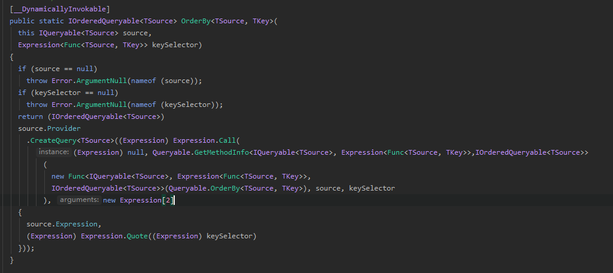

# EF 使用OrderBy 传入Func Vs Expression #

## 场景说明 ##

EF分页：**OrderBy** **Skip** **Take**

使用发现 **OrderBy** 参数传 **Func** 比 **Expression** 慢[数据越多越慢]

而**Expression**速度与数据量无明显关系

## Func ##

	/// 
按根据某个键按升序对序列的元素进行排序。

    /// <param name="source">一个要排序的值序列。</param>
    /// <param name="keySelector">用于从元素中提取键的函数。</param>
    /// <typeparam name="TSource">
    ///   中的元素的类型 <paramref name="source" />。
    /// </typeparam>
    /// <typeparam name="TKey">
    ///   返回的键的类型 <paramref name="keySelector" />。
    /// </typeparam>
    /// <returns>
    ///   <see cref="T:System.Linq.IOrderedEnumerable`1" /> 的元素根据某个键进行排序。
    /// </returns>
    /// <exception cref="T:System.ArgumentNullException">
    ///   <paramref name="source" /> 或 <paramref name="keySelector" /> 为 <see langword="null" />。
    /// </exception>
    [__DynamicallyInvokable]
    public static IOrderedEnumerable<TSource> OrderBy<TSource, TKey>(
      this IEnumerable<TSource> source,
      Func<TSource, TKey> keySelector)
    {
      return (IOrderedEnumerable<TSource>) new OrderedEnumerable<TSource, TKey>(source, keySelector, (IComparer<TKey>) null, false);
    }

查看相关构造：

	internal OrderedEnumerable(
      IEnumerable<TElement> source,
      Func<TElement, TKey> keySelector,
      IComparer<TKey> comparer,
      bool descending)
    {
      if (source == null)
        throw Error.ArgumentNull(nameof (source));
      if (keySelector == null)
        throw Error.ArgumentNull(nameof (keySelector));
      this.source = source;
      this.parent = (OrderedEnumerable<TElement>) null;
      this.keySelector = keySelector;
      this.comparer = comparer != null ? comparer : (IComparer<TKey>) Comparer<TKey>.Default;
      this.descending = descending;
    }

简单的属性赋值，再查看类定义：

	internal class OrderedEnumerable<TElement, TKey> : OrderedEnumerable<TElement>

查看父类定义

	internal abstract class OrderedEnumerable<TElement> : IOrderedEnumerable<TElement>, IEnumerable<TElement>, IEnumerable

	    public IEnumerator<TElement> GetEnumerator()
    {
      Buffer<TElement> buffer = new Buffer<TElement>(this.source);
      if (buffer.count > 0)
      {
        int[] map = this.GetEnumerableSorter((EnumerableSorter<TElement>) null).Sort(buffer.items, buffer.count);
        for (int i = 0; i < buffer.count; ++i)
          yield return buffer.items[map[i]];
        map = (int[]) null;
      }
    }

    internal abstract EnumerableSorter<TElement> GetEnumerableSorter(
      EnumerableSorter<TElement> next);

核心是调用GetEnumerableSorter，再查看子类定义

	internal override EnumerableSorter<TElement> GetEnumerableSorter(
      EnumerableSorter<TElement> next)
    {
      EnumerableSorter<TElement> next1 = (EnumerableSorter<TElement>) new EnumerableSorter<TElement, TKey>(this.keySelector, this.comparer, this.descending, next);
      if (this.parent != null)
        next1 = this.parent.GetEnumerableSorter(next1);
      return next1;
    }

上面就是创建了一个OrderedEnumerable<TElement, TKey>，接着查看Skip方法

	public static IEnumerable<TSource> Skip<TSource>(
      this IEnumerable<TSource> source,
      int count)
    {
      if (source == null)
        throw Error.ArgumentNull(nameof (source));
      return Enumerable.SkipIterator<TSource>(source, count);
    }

    private static IEnumerable<TSource> SkipIterator<TSource>(
      IEnumerable<TSource> source,
      int count)
    {
      using (IEnumerator<TSource> e = source.GetEnumerator())
      {
        while (count > 0 && e.MoveNext())
          --count;
        if (count <= 0)
        {
          while (e.MoveNext())
            yield return e.Current;
        }
      }
    }

Take:

	public static IEnumerable<TSource> Take<TSource>(
      this IEnumerable<TSource> source,
      int count)
    {
      if (source == null)
        throw Error.ArgumentNull(nameof (source));
      return Enumerable.TakeIterator<TSource>(source, count);
    }

    private static IEnumerable<TSource> TakeIterator<TSource>(
      IEnumerable<TSource> source,
      int count)
    {
      if (count > 0)
      {
        foreach (TSource source1 in source)
        {
          yield return source1;
          if (--count == 0)
            break;
        }
      }
    }

Skip 与 Take 都使用 yield 来实现延时作用。

System.Linq.Enumerable.Count：

	public static int Count<TSource>(this IEnumerable<TSource> source)
    {
      if (source == null)
        throw Error.ArgumentNull(nameof (source));
      ICollection<TSource> sources = source as ICollection<TSource>;
      if (sources != null)
        return sources.Count;
      ICollection collection = source as ICollection;
      if (collection != null)
        return collection.Count;
      int num = 0;
      using (IEnumerator<TSource> enumerator = source.GetEnumerator())
      {
        while (enumerator.MoveNext())
          checked { ++num; }
      }
      return num;
    }

source.GetEnumerator() 调用 System.Linq.OrderedEnumerable.GetEnumerableSorter 方法

查看方法只构建keySelector(排序)、IComparer<TKey>(比较)、descending(是否降序) 

然后调用this.parent.GetEnumerableSorter(next1);

即便不知道parent.GetEnumerableSorter的实现也能知道没有进行分页，因为传参中就不包含分页相关的参数

----------

## Expression ##

    public static IOrderedQueryable<TSource> OrderBy<TSource, TKey>(
      this IQueryable<TSource> source,
      Expression<Func<TSource, TKey>> keySelector)
    {
      if (source == null)
        throw Error.ArgumentNull(nameof (source));
      if (keySelector == null)
        throw Error.ArgumentNull(nameof (keySelector));
      return (IOrderedQueryable<TSource>) 
      source.Provider
        .CreateQuery<TSource>((Expression) Expression.Call(
          (Expression) null, Queryable.GetMethodInfo<IQueryable<TSource>, Expression<Func<TSource, TKey>>,IOrderedQueryable<TSource>>
            (
              new Func<IQueryable<TSource>, Expression<Func<TSource, TKey>>, 
              IOrderedQueryable<TSource>>(Queryable.OrderBy<TSource, TKey>), source, keySelector
            ), new Expression[2]
      {
        source.Expression,
        (Expression) Expression.Quote((Expression) keySelector)
      }));
    }

查看Skip和Take:

	public static IQueryable<TSource> Skip<TSource>(
      this IQueryable<TSource> source,
      int count)
    {
      if (source == null)
        throw Error.ArgumentNull(nameof (source));
      return source.Provider.CreateQuery<TSource>((Expression) Expression.Call((Expression) null, Queryable.GetMethodInfo<IQueryable<TSource>, int, IQueryable<TSource>>(new Func<IQueryable<TSource>, int, IQueryable<TSource>>(Queryable.Skip<TSource>), source, count), new Expression[2]
      {
        source.Expression,
        (Expression) Expression.Constant((object) count)
      }));
    }

	public static IQueryable<TSource> Take<TSource>(
      this IQueryable<TSource> source,
      int count)
    {
      if (source == null)
        throw Error.ArgumentNull(nameof (source));
      return source.Provider.CreateQuery<TSource>((Expression) Expression.Call((Expression) null, Queryable.GetMethodInfo<IQueryable<TSource>, int, IQueryable<TSource>>(new Func<IQueryable<TSource>, int, IQueryable<TSource>>(Queryable.Take<TSource>), source, count), new Expression[2]
      {
        source.Expression,
        (Expression) Expression.Constant((object) count)
      }));
    }

	public static int Count<TSource>(this IQueryable<TSource> source)
    {
      if (source == null)
        throw Error.ArgumentNull(nameof (source));
      return source.Provider.Execute<int>((Expression) Expression.Call((Expression) null, Queryable.GetMethodInfo<IQueryable<TSource>, int>(new Func<IQueryable<TSource>, int>(Queryable.Count<TSource>), source), source.Expression));
    }

speculation ： 通过组装Expression来现实分页

----------

测试代码:

	Func<User, int> func = user => user.UserID;
    Expression<Func<User, int>> expression = user => user.UserID;

    Console.WriteLine(mysqlContext.Users.OrderBy(func).Skip(0).Take(1000).Count());
    Console.WriteLine(mysqlContext.Users.OrderBy(expression).Skip(0).Take(1000).Count());

生成sql:

Func版：

	SELECT
	`Extent1`.`UserID`,
	`Extent1`.`UserName`,
	`Extent1`.`PassWord`,
	`Extent1`.`CellPhone`,
	`Extent1`.`NickName`,
	`Extent1`.`LateOnLineTime`,
	`Extent1`.`UserEnableState`,
	`Extent1`.`CreateTime`,
	`Extent1`.`UpdatePassWordTime`,
	`Extent1`.`UserGroupID`
	FROM `Users` AS `Extent1`

Expression版：

	SELECT
	`GroupBy1`.`A1` AS `C1`
	FROM (SELECT
	COUNT(`Limit1`.`C1`) AS `A1`
	FROM (SELECT
	`Project1`.`C1`,
	`Project1`.`UserID`
	FROM (SELECT
	1 AS `C1`,
	`Extent1`.`UserID`
	FROM `Users` AS `Extent1`) AS `Project1`
	 ORDER BY
	`Project1`.`UserID` ASC LIMIT 0,1000) AS `Limit1`) AS `GroupBy1`

> 通过查看sql log 可知，当传递Func进行分页时未生成 分页脚步，所以Func时是在内存分页，从而导致传Func时，数据越大越慢（因为Func要加载所以数据）

----------
since:8/30/2019 5:08:18 PM 